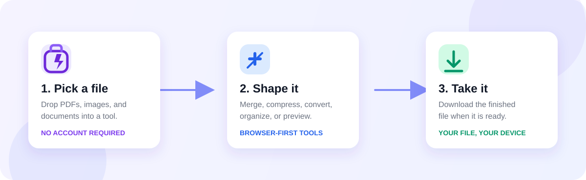

<div align="center">


# PockitUp

### A pocket-sized toolbox for the files, formats, and tiny jobs that slow you down.

<p>
  <a href="https://vitejs.dev/"></a>
  <a href="https://developer.mozilla.org/en-US/docs/Web/JavaScript"></a>
  
  
</p>

<p>
  <a href="#what-is-pockitup">What it is</a> ·
  <a href="#toolbox">Toolbox</a> ·
  <a href="#quick-start">Quick start</a> ·
  <a href="BUG_FINDINGS.md">Bug findings</a>
</p>

</div>

<p align="center">
  
</p>

<p align="center">
  
</p>

## What is PockitUp?

PockitUp is a browser-first collection of everyday tools. It puts document work, quick conversions, small calculations, and practical utilities in one calm workspace instead of making you hunt through a dozen single-purpose websites.

The core file workflows run in the browser, so files used by those workflows do not need to be uploaded to a PockitUp backend. The current page loads several helper libraries, fonts, and embeds from CDNs, so the first load still needs network access.

## Toolbox

| Area | What you can do |
| --- | --- |
| **PDF** | Merge, split, compress, rotate, protect, unlock, convert, add page numbers, and preview PDFs |
| **Images** | Convert, resize, compress, crop, rotate, remove backgrounds, and create image PDFs |
| **Documents** | Work with Word, Excel, PowerPoint, text, and file-type conversion flows |
| **Utilities** | Stopwatch, countdown timer, number-to-words, scoreboard, Roman numerals, and more |
| **Media & social** | Video/audio utility surfaces plus Instagram post, reel, and story tools |
| **Developer & security** | JSON, encoding, hashing, password, color, and other small helper tools |
| **Backup** | ZIP archiving and file packaging |

Some cards are intentionally marked as coming soon while their workflows are still being built. That keeps the interface discoverable without pretending an unfinished action is ready.

## Why it feels useful

- **One home for small jobs** — tools are grouped by the way people actually look for them.
- **Drag, arrange, export** — file flows are designed around a quick input-to-download loop.
- **Light and dark themes** — the workspace follows the preferred visual mode and can be toggled.
- **No account wall for local work** — the main PDF workflows can be tested without sign-in.
- **Responsive by default** — the layout includes mobile behavior instead of treating a phone as an afterthought.

## Quick start

### Requirements

- Node.js 18 or newer
- npm
- A modern browser with support for the File, Blob, Canvas, and Web APIs

### Run locally

```bash
git clone https://github.com/LordHorizon01/pockit-up.git
cd pockit-up
npm install
npm run dev
```

Open the local URL printed by Vite. The default development port is `5173`.

### Build and preview production

```bash
npm run build
npm run preview
```

The production entry point is `index.html`, and Vite should create the compiled site in `dist/`.

> If your machine reports that the npm command itself is broken, repair or reinstall Node.js/npm first. The project scripts are standard Vite scripts; a broken package-manager installation is an environment issue, not an application build result.

## Project map

```text
.
├── index.html                 # Main single-page interface and tool surfaces
├── public/
│   ├── pdfmerger.js           # Client-side behavior and file workflows
│   ├── pdfmerger.css          # Shared visual styling
│   ├── _sdk/                  # Local SDK runtime files used by the page
│   └── assets/                # Logos and image assets
├── docs/
│   └── brand/                 # README brand, badge, and workflow SVGs
├── bugs found/                # One plain-language history file per fixed bug
├── BUG_FINDINGS.md            # Audit evidence and severity decisions
├── BUG_FIX_PLAN.md            # Prioritized fix plan and completion record
├── package.json               # Scripts and dependencies
└── vite.config.js             # Local dev server configuration
```

## Test the important paths

The most valuable smoke checks are small and repeatable:

1. Start the app and confirm `/` loads without browser console errors.
2. Add two PDFs, reorder them, merge them, and download the result.
3. Add files to the ZIP tool and confirm the archive downloads.
4. Try a crafted filename such as `` and confirm it stays text.
5. Resize the viewport to a phone width and confirm controls remain usable.
6. Run `npm run build` and confirm `dist/index.html` plus the referenced files exist.

The completed audit and fix evidence lives in [BUG_FINDINGS.md](BUG_FINDINGS.md), while the planning record is in [BUG_FIX_PLAN.md](BUG_FIX_PLAN.md).

## Bug-fix memory

This repository keeps a durable, human-readable record so the same mistakes are less likely to return. Each file in [`bugs found/`](bugs%20found/) contains:

- the bug in simple language;
- what a user or developer could observe;
- what changed to fix it;
- how the fix was verified; and
- a prevention rule for future work.

Start with [BUG-001: production root 404](bugs%20found/BUG-001-production-build-root-404.md) if you are changing the Vite entry point or deployment layout.

## Contributing

Keep changes focused, test the user path you touched, and update the bug history when a new bug teaches us something worth remembering. For a new bug record, copy the tone and structure of the existing files rather than silently burying the lesson in a commit message.

Before opening a pull request:

```bash
npm run build
git diff --check
```

Please include the user-visible behavior, the verification performed, and any check that could not run in the pull request description.

## Current scope

PockitUp is currently a client-heavy single-page tool collection, not a hosted account platform. It has no application backend, authentication system, or server-side file store in this repository. If those boundaries change, revisit the security assumptions in [BUG_FINDINGS.md](BUG_FINDINGS.md) and run a new audit before shipping.

<div align="center">

Made for the little tasks that deserve a better home.

</div>
